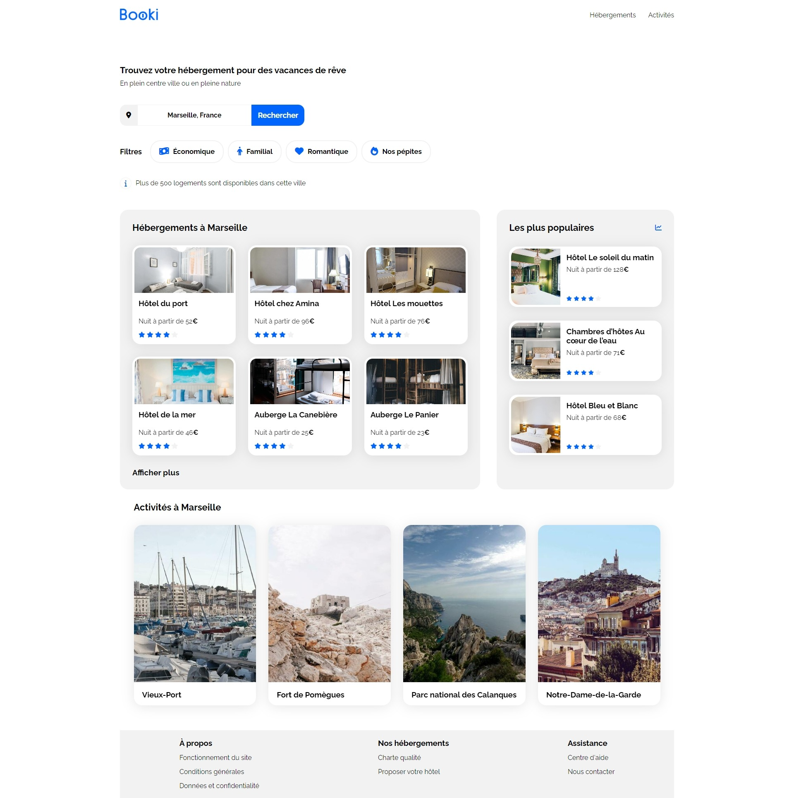

# Projet 2 - Booki

Deuxième projet de la formation OpenClassrooms : Développeur d'applications Javascript/React.
Objectif : 
- Découpage d'une maquette existante
- Intégration de la maquette
- Gestion du responsive (Desktop / Tablette / Mobile)

## Installation

La seule librairie intégrée au projet est Font-Awesome, et est importé en CDN.

## Demo

